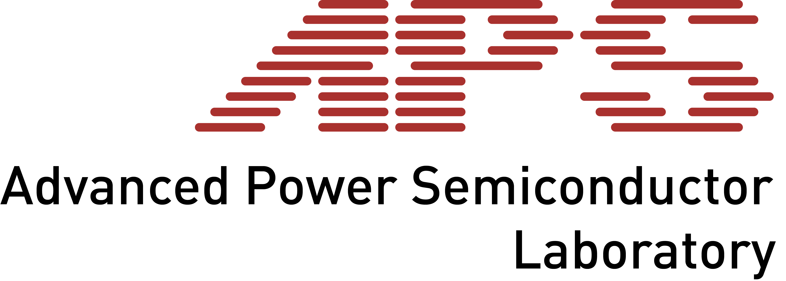

Hi, we are @ethapslab
- We're interested in semiconductor devices and modules for power electronics
- We’re partially switching to use python for data acquisition and analysis
- You reach us through our websiste: aps.ee.ethz.ch

<!---
ethapslab/ethapslab is a ✨ special ✨ repository because its `README.md` (this file) appears on your GitHub profile.
You can click the Preview link to take a look at your changes.
--->
